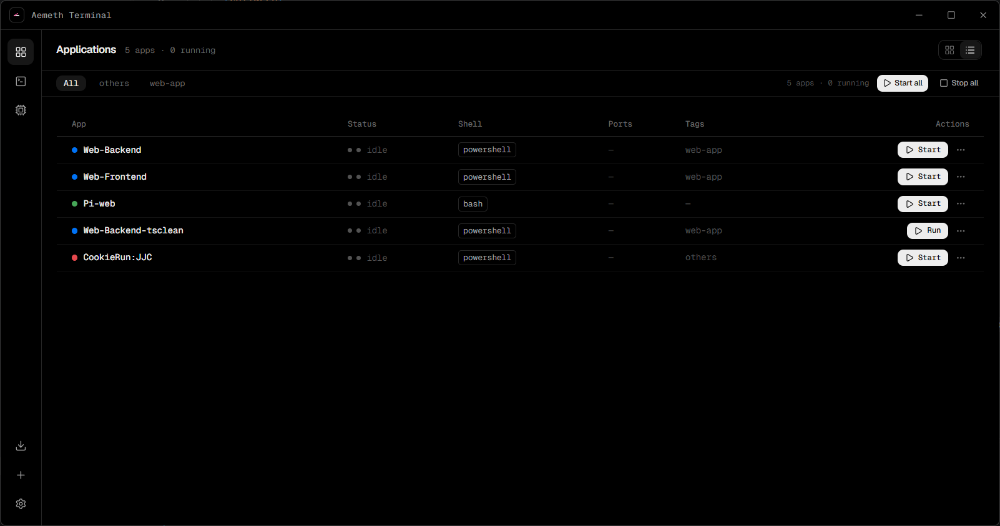

<div align="center">

#  Aemeth Terminal

**A multi-session service launcher & terminal workbench for developers.**

One card per service — preset the shell, working directory, and boot commands, then launch, monitor, and switch between all your terminals in one place.

[](./LICENSE)
[](https://tauri.app/)
[](https://react.dev/)
[](https://www.typescriptlang.org/)
[](#)

[English](./README.md) · [简体中文](./README.zh-CN.md)



</div>

Running a microservice stack locally usually means juggling a dozen console windows, each with its own `cd` + `yarn dev` ritual. Aemeth turns every service into an **app card** with a preset boot sequence — one click brings the whole stack up, and a tabbed terminal workbench keeps every session a keystroke away.

## Features

- 🗂️ **App cards** — one card per service: name, color, shell type, working directory, boot sequence, and live status (running / exited with code / stopped).
- ⚡ **Boot sequences** — configure ordered commands per app (e.g. `cd E:\project\api` → `yarn dev`), with a per-command send delay and an optional "wait for shell ready" startup delay.
- 🐚 **Multi-shell** — each app picks its own shell: **PowerShell / PowerShell 7 (pwsh) / CMD / Git Bash**, auto-detected from your machine.
- 🖥️ **Terminal workbench** — Windows 11-style tabs; sessions stay resident in memory for instant switching. Middle-click to close a tab, right-click to copy/paste (classic console muscle memory).
- 🚀 **Auto-launch** — mark apps to start automatically when Aemeth opens.
- ⌨️ **Keyboard-first** — `Ctrl+Tab` to cycle tabs, `Ctrl+1…9` to jump, `Ctrl+W` to close.
- 🌏 **i18n** — English / 简体中文, auto-detected from the system and persisted; switchable from the sidebar.
- 🔤 **Typography** — Geist Sans / Geist Mono for Latin, Noto Sans SC for CJK — in the UI *and* the terminal.
- 🧹 **Clean exit** — closing the window terminates every spawned shell process.
- ⚫ **Geist / Vercel-inspired visuals** — pure black canvas, hairline borders, color reserved for status semantics.

## Two surfaces

| Surface | Description |
| --- | --- |
| **Apps** | Overview of every service's config and runtime status — start / stop / restart / edit / delete, with search. |
| **Terminals** | One tab per running service, fully rendered by xterm.js (true color, WebGL acceleration, 10,000-line scrollback). |

## Getting started

### Prerequisites

- [Node.js ≥ 20](https://nodejs.org/) and [pnpm](https://pnpm.io/)
- [Rust (stable)](https://rustup.rs/)
- [Tauri platform prerequisites](https://tauri.app/start/prerequisites/) for your OS

### Run from source

```bash
pnpm install        # install frontend dependencies
pnpm tauri dev      # development mode (hot reload)
pnpm tauri build    # production build → src-tauri/target/release/bundle
```

## Keyboard shortcuts

| Keys | Action |
| --- | --- |
| `Ctrl + Tab` / `Ctrl + Shift + Tab` | Next / previous terminal tab |
| `Ctrl + 1…9` | Jump to tab N |
| `Ctrl + W` | Close current tab (and stop its process) |
| Right-click in terminal | Copy if text is selected, otherwise paste |
| Middle-click a tab | Close that tab |

## Architecture

```
┌────────────────────────────────────────────────────────┐
│  Webview (React 19 + shadcn/ui + Tailwind v4)          │
│                                                        │
│  zustand store ──► SessionRegistry (xterm.js pool)     │
│        │                 │                             │
│        ▼                 ▼                             │
│  plugin-store       invoke / events                    │
│  (aemeth.json)           │                             │
└──────────────────────────┼─────────────────────────────┘
                           ▼
┌────────────────────────────────────────────────────────┐
│  Rust core (Tauri 2)                                   │
│                                                        │
│  PtyManager ── portable-pty (ConPTY) ── powershell /   │
│    │                                  cmd / bash / pwsh │
│    ├─ reader thread ──► pty://output (base64 events)   │
│    ├─ reaper thread ──► pty://exit   (exit codes)      │
│    └─ scheduler   ──► feeds boot commands by delay     │
└────────────────────────────────────────────────────────┘
```

- **`src-tauri/src/pty.rs`** — session lifecycle: spawn, write, resize, kill, event stream. Output is chunked as base64 to avoid splitting UTF-8 sequences.
- **`src-tauri/src/shells.rs`** — shell detection & resolution (PATH + common install locations).
- **`src/lib/session-registry.ts`** — xterm instance pool; terminals are created when a session starts, so switching views never loses output.
- **`src/store/use-app-store.ts`** — global state + persistence via `tauri-plugin-store`.

## Project structure

```
├── src/                    # Frontend
│   ├── components/
│   │   ├── apps/           # App list, cards, edit/delete dialogs
│   │   ├── terminals/      # Tab bar + terminal panes
│   │   ├── layout/         # Sidebar navigation, title bar
│   │   └── shared/ ui/     # Status pills / shadcn primitives
│   ├── hooks/ lib/ store/  # Shortcuts, IPC, session registry, state
├── src-tauri/              # Rust backend
│   └── src/{lib,pty,shells}.rs
```

## Tech stack

| Layer | Technology |
| --- | --- |
| Desktop shell | [Tauri 2](https://tauri.app/) |
| UI | React 19 · TypeScript 7 · Vite · Tailwind CSS v4 · shadcn/ui |
| State | zustand + `tauri-plugin-store` |
| Terminal | [xterm.js](https://xtermjs.org/) (WebGL, fit, search, unicode11 addons) |
| PTY | [portable-pty](https://crates.io/crates/portable-pty) (ConPTY on Windows) |

## License

[MIT](./LICENSE) © EnochRen

## Acknowledgements

Built on the shoulders of great open source: [Tauri](https://tauri.app/), [xterm.js](https://xtermjs.org/), [portable-pty](https://github.com/wez/wezterm/tree/main/termwiz), [shadcn/ui](https://ui.shadcn.com/), and the [Geist](https://vercel.com/font) font family.
